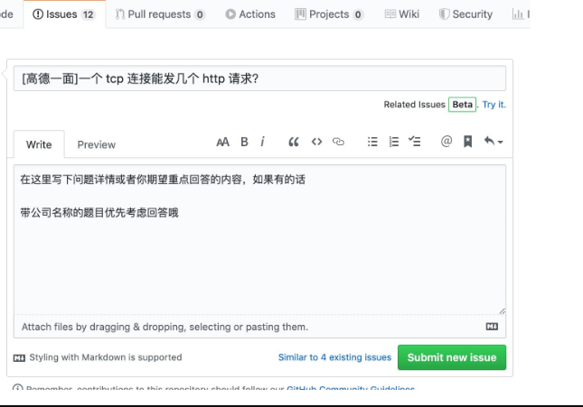

一份涵盖大部分Web前端开发程序员所需要掌握的核心知识。前端技术仓库，Vue 源码解析，React 深度实践，TypeScript 进阶艺术，工程化，性能优化实践…… Leetcode 【Suggest +1 ‍💻 Leetcode brush question & answers】leetcode题解，记录自己的leetcode解题之路,后端学习进阶......

提问让我们回答
打开 新建 Issue 链接, 格式如下：

Issue 规范
issue 仅用于提交面试题，其它内容可能会被直接关闭。如果你在使用时产生了疑问，可以加作者微信
Issue 的描述里请使用Markdown格式，注意有代码的时候请使用代码块。
Pull Request 规范
请先 fork 一份到自己的项目下，不要直接在仓库下建分支。
类库的commit 信息要以add 提交类型(vue OR ES6) questions 的形式填写。
提交 PR 前请 rebase，确保 commit 记录的整洁。
确保 PR 是提交到 master 分支，目前就只有一个分支。
合并需要 review 通过后即可合并。
感谢
提交PR贡献的朋友将会在首页显示个人头像及github的链接，表示感谢！

你可以
你可以在Issues出题，Title中写题目，Leave a comment补充题目要求内容等，让我们来做题
你可以在这里刷题，写出你对每道题的思路解答
